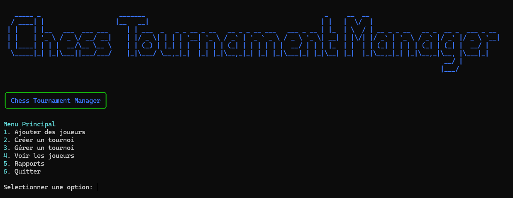
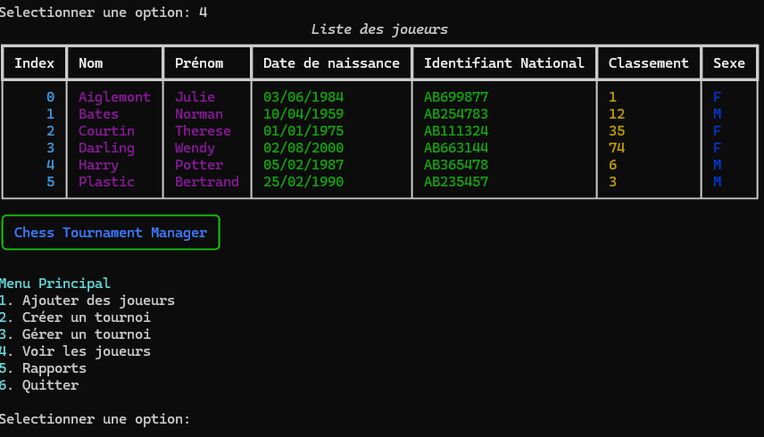
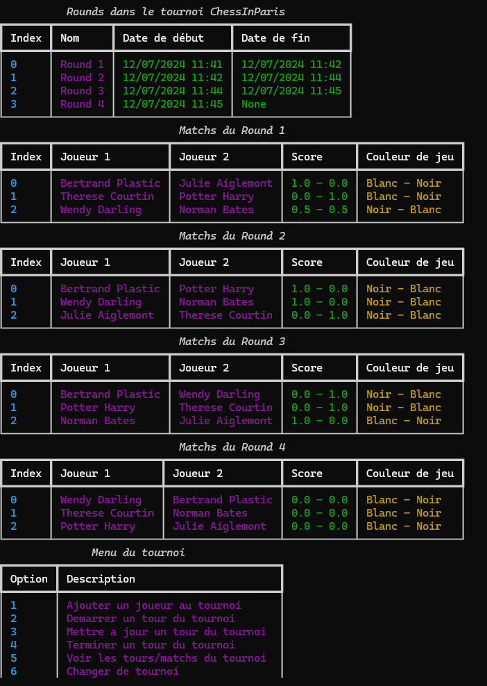
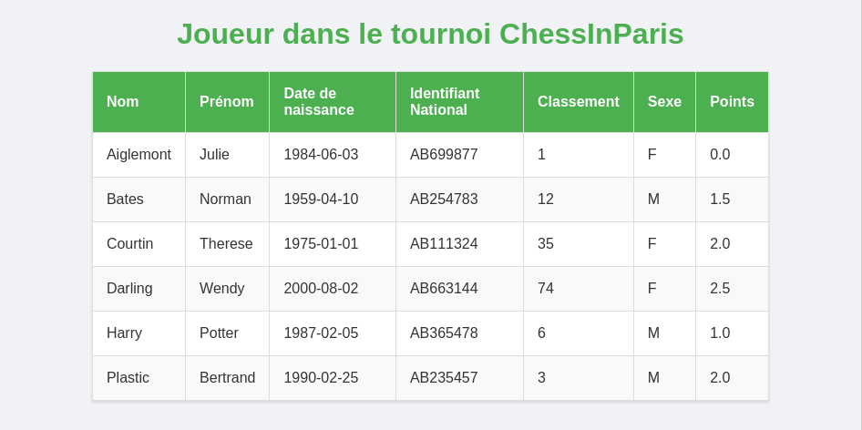
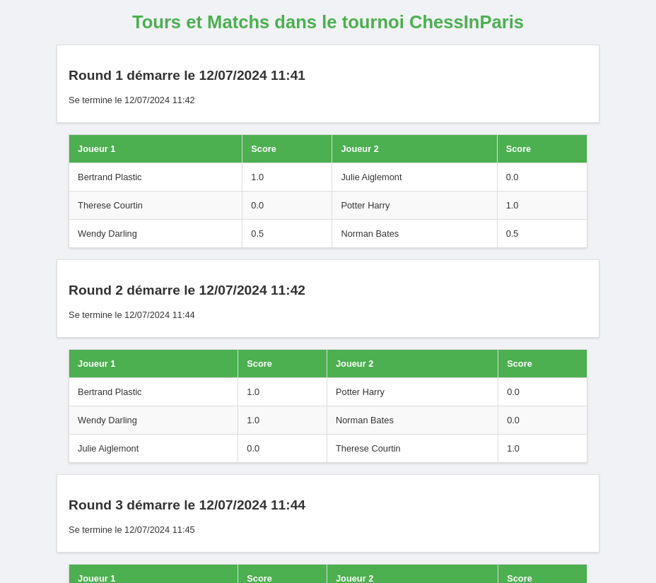
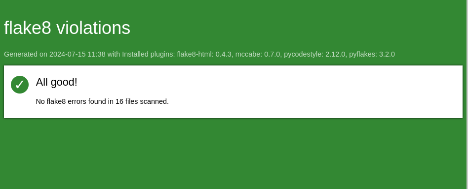

# Gestionnaire de Tournoi d'Échecs

Le Gestionnaire de Tournoi d'Échecs est une application Python conçue pour aider à gérer les tournois d'échecs, y compris l'inscription des joueurs, la planification des tournois et le suivi des tours et des matchs de chaque tournoi.

## Table des Matières

- [Fonctionnalités](#fonctionnalités)
- [Installation](#installation)
- [Utilisation](#utilisation)
- [Génération de Rapports](#génération-de-rapports)
- [Screenshots](#screenshots)
- [Configuration de Flake8 et Rapport HTML](#configuration-de-flake8-et-rapport-html)
- [Licence](#licence)

## Fonctionnalités

- Ajouter des joueurs à la base de données.
- Créer et gérer des tournois d'échecs.
- Ajouter des joueurs aux tournois.
- Générer automatiquement des paires de matchs.
- Suivre les tours du tournoi et les résultats des matchs.
- Générer des rapports HTML détaillés pour les joueurs, les tournois et les tours.

## Installation

1. Clonez le dépôt :
   ```bash
   git clone https://github.com/LuuNa-JD/chess_tournament.git
   cd chess_tournament
   ```
2. Créez un environnement virtuel et activez-le :
   ```bash
    python3 -m venv venv
    source venv/bin/activate
    ```
3. Installez les dépendances :
    ```bash
    pip install -r requirements.txt
    ```

## Utilisation

1. Lancez l'application :
    ```bash
    python main.py
    ```

Vous avez accès à un menu où vous pouvez sélectionner diverses options pour créer des tournois, ajouter des joueurs, démarrer des tours, mettre à jour les résultats des matchs et générer des rapports.


## Génération de Rapports

Les rapports peuvent être générés et visualisés directement depuis l'interface de l'application. Les types de rapports suivants sont disponibles :

- Rapport des joueurs : liste de tous les joueurs enregistrés.
- Rapport des tournois : liste de tous les tournois créés.
- Rapport des détails d'un tournoi : affiche les détails d'un tournoi spécifique.
- Rapport des Joueurs du Tournoi : Liste les joueurs dans un tournoi spécifique.
- Rapport des Matchs et des Rounds du Tournoi : Liste les matchs et les tours dans un tournoi spécifique.

Les rapports sont enregistrés sous forme de fichiers HTML dans le répertoire reports et peuvent être ouverts dans votre navigateur web.


## Screenshots

###  Liste des joueurs sur le shell


###  Gestion d'un tournoi sur le shell


###  Rapport des joueurs dans un tournoi


###  Rapport des matchs et des rounds dans un tournoi



## Configuration de Flake8 et Rapport HTML

Le projet est configuré pour utiliser Flake8 pour vérifier la conformité du code avec les normes PEP 8. Pour exécuter Flake8, utilisez la commande suivante :

```bash
flake8
```

Un rapport HTML sera généré dans le répertoire flake_report.

Voici le dernier rapport généré :



## Licence

Ce projet est sous licence MIT. Voir le fichier [LICENSE](LICENSE) pour plus d'informations.
